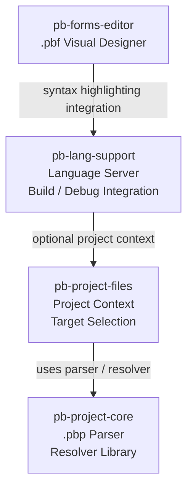

# PureBasic VS Code Language Suite (Monorepo)

[](https://github.com/CalDymos/vscode-pb-lang-suite/tags)
[](https://github.com/CalDymos/vscode-pb-lang-suite/tags)
[](https://github.com/CalDymos/vscode-pb-lang-suite/tags)
[](https://github.com/CalDymos/vscode-pb-lang-suite/tags)

This repository contains multiple VS Code extensions related to PureBasic.

The suite provides language support, project integration, and visual editing tools for the PureBasic ecosystem inside Visual Studio Code.

## Packages

### [pb-lang-support](packages/pb-lang-support)

PureBasic language support (TextMate grammar + Language Server for `.pb` and `.pbi`).

Features include:

- syntax highlighting
- language server diagnostics
- hover and signature help
- PureBasic API function dataset
- build and run integration
- debugger integration
- optional `.pbp` project integration via **pb-project-files**
- text editing support for **PureBasic Forms (`.pbf`)**

### [pb-project-files](packages/pb-project-files)

Optional companion extension for `.pbp` project discovery and active target management.

Features include:

- `.pbp` project file editor
- project and target discovery
- active target selection
- project template support for creating new PureBasic projects
- customizable Raw XML view for project files

### [pb-project-core](packages/pb-project-core)

Shared library used by the suite for parsing and resolving `.pbp` projects.

The library provides:

- `.pbp` project parser
- project validation
- target selection utilities
- build path resolution
- deterministic `.pbp` writer

### [pb-forms-editor](packages/pb-forms-editor)

PureBasic Forms editor (custom editor for `.pbf` files).

Provides a visual designer for PureBasic forms and supports switching between:

- graphical form designer
- raw `.pbf` text editing

When **pb-lang-support** is installed, the text editor mode supports syntax highlighting for the `purebasic-form` language.

## Feature Matrix

| Feature | pb-lang-support | pb-project-files | pb-project-core | pb-forms-editor |
|--------|-----------------|------------------|-----------------|-----------------|
| PureBasic syntax highlighting [`.pb`, `.pbi`, `.pbf`] | ✅ | – | – | – |
| Language Server (hover, signatures, diagnostics) [`.pb`, `.pbi`] | ✅ | – | – | – |
| PureBasic API function dataset | ✅ | – | – | – |
| Build / Run integration | ✅ | – | – | – |
| Debugger integration | ✅ | – | – | – |
| `.pbp` project discovery | – | ✅ | – | – |
| Active target selection | – | ✅ | – | – |
| `.pbp` project editor | – | ✅ | – | – |
| Create new project from template | – | ✅ | – | – |
| `.pbp` parser | – | – | ✅ | – |
| `.pbp` writer | – | – | ✅ | – |
| Target / build path resolution | – | – | ✅ | – |
| Project validation utilities | – | – | ✅ | – |
| `.pbf` visual form designer | – | – | – | ✅ |
| `.pbf` text editor mode | – | – | – | ✅ |
| `.pbf` syntax highlighting (via pb-lang-support) | ✅ | – | – | ✅ |
| Integration with PureBasic projects | ✅ | ✅ | ✅ | – |

## Architecture Overview

The extensions are designed to work both independently and together.



- **pb-lang-support** provides the core language features.
- **pb-project-files** supplies project context and target resolution.
- **pb-project-core** is the shared `.pbp` parser and resolver library.
- **pb-forms-editor** integrates with `pb-lang-support` for `.pbf` syntax highlighting.

## Branch Development Strategy

This repository uses a two-branch model:

- `main` is the **stable release branch**
- `devel` is the **development and integration branch**

Typical flow:

feature branch → PR → `devel`  
release PR → `devel` → `main`

Hotfixes may be applied directly to `main` and later merged back to `devel`.

## Development

### Prerequisites

- Node.js
- npm

### Install

```bash
npm ci
```

### Workspace shortcuts

```bash
npm run w:core
npm run w:lang
npm run w:forms
npm run w:pbp
```

### Compile packages

```bash
npm run comp:core
npm run comp:lang
npm run comp:forms
npm run comp:pbp
npm run comp
```

### Create VSIX packages

```bash
npm run vsix:lang
npm run vsix:forms
npm run vsix:pbp
npm run vsix
```

### Test

```bash
npm run test:core
npm run test:lang
```

### Versioning

```bash
npm run ver:patch
npm run ver:patch:lang
npm run ver:patch:forms
npm run ver:patch:pbp
npm run ver:patch:core

npm run ver:minor
npm run ver:minor:lang
npm run ver:minor:forms
npm run ver:minor:pbp
npm run ver:minor:core
```

### Release helpers

```bash
npm run tag:all
npm run tag:suite
npm run tag:lang
npm run tag:forms
npm run tag:pbp
npm run backmerge
```
